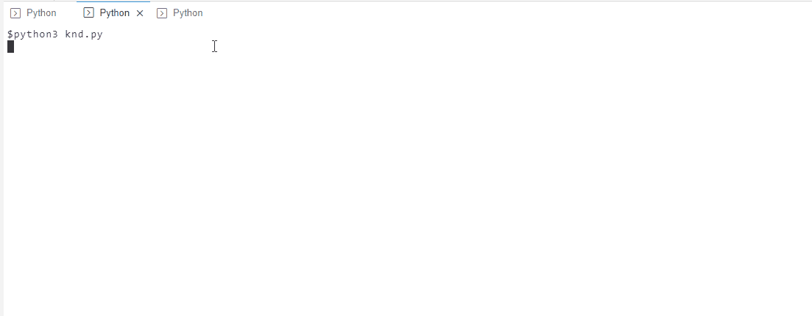

# kubernetes-api-knd

Problem statement:

 

Using Python 3 and the Kubernetes Python client (https://github.com/kubernetes-client/python) build out a tool that follows the given man page's description.

- Please do not use kubectl in any way.

- Please do not read in a yaml file to deploy an app.

- Implement a CLI-based progress bar to indicate deployment/scaling progress as part of your work.

- Feel free to use any library you wish to help build the CLI, progress bar, and logging constructs.

- The tool should be smart enough to update an existing deployment and alter the replicas and/or NGINX version when applicable.

- Provide a way to install any dependencies that you may use, as well as a method to install/uninstall your tool.

 

We are interested in the structure and readability of the code. Once complete, send the files back to me along with a summary explanation on how to run your CLI, the expected output, as well as any insights or observations you had along the way.

 

We are hoping that this will not take up more than one day of your time, but if you get stuck or have clarifying questions feel free to reach out to the team by replying to this email. Let us know how long you spent overall on the coding portion, once completed.

 

 

Man page:

 

KND(1)

 

NAME

    knd

 

SYNOPSIS

    knd [--replicas=replicas] [--nginx-version=version] [deployment-name]

 

DESCRIPTION

    knd (Kubernetes NGINX deployer) deploys NGINX on a Kubernetes cluster, and verifies that it has come up healthy.

    A CLI progress bar is provided to indicate the deployment/scaling progress.

    The application can be deployed with a configurable number of replicas.
    
SAMPLE RUNS

